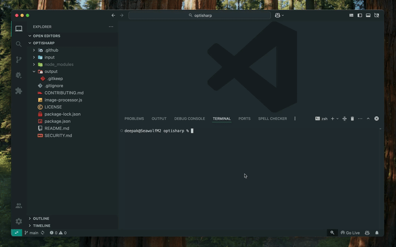

# Sharp Image Processor


A high-performance Node.js utility for batch processing images using the [Sharp](https://sharp.pixelplumbing.com/) library. This tool is perfect for optimizing images for web usage, reducing storage requirements, or preparing media for various platforms.

<p align="center">
  
  <br>
  <a href="assets/optisharp.mp4">View original video in full quality</a>
</p>

## 🚀 Features

- **Batch Processing**: Process multiple images at once from an input directory
- **Format Conversion**: Convert between JPEG, PNG, WebP, AVIF, TIFF formats
- **Smart Resizing**: Resize images while maintaining aspect ratio
- **Advanced Optimization**: Apply format-specific optimizations for maximum compression
- **Quality Control**: Adjust output quality to balance file size and image quality
- **Metadata Handling**: Option to strip metadata to further reduce file size
- **Image Enhancement**: Apply sharpening to improve clarity
- **Comprehensive Reports**: Detailed summary statistics on processing results
- **User-Friendly Output**: Clear logging and formatted statistics
- **Optional Watermarking**: Add text or image watermarks with customizable options

## 📋 Requirements

- **Node.js**: v18.17.0 or later
- **NPM**: For installing dependencies

## 🔧 Installation

1. Clone this repository:
   ```bash
   git clone https://github.com/deepakness/optisharp.git
   cd optisharp
   ```

2. Install the required dependencies:
   ```bash
   npm install
   ```

## 💻 Basic Usage

1. Place all your images in the `/input` folder
2. Run the script:
   ```bash
   npm start
   ```
   or
   ```bash
   node image-processor.js
   ```
3. Processed images will be saved in the `/output` folder
4. View the summary report for optimization statistics

## 📝 Configuration

All configuration options are located at the top of the `image-processor.js` file for easy customization:

### Output Format

```javascript
// Output format: 'jpeg', 'png', 'webp', 'avif', 'tiff', or 'original' to keep the source format
const OUTPUT_FORMAT = 'jpeg';
```

### Quality Settings

```javascript
// Image quality (1-100) - Higher values mean better quality but larger file size
const QUALITY = 80;
```

### Resize Options

```javascript
// Resize options
const RESIZE = {
  enabled: true,
  width: 1200,  // Set to null to maintain aspect ratio based on height
  height: null, // Set to null to maintain aspect ratio based on width
  fit: 'inside' // 'cover', 'contain', 'fill', 'inside', 'outside'
};
```

### Optimizations

```javascript
// Apply additional image optimizations
const OPTIMIZATIONS = {
  sharpen: true,      // Apply mild sharpening to the image
  removeMetadata: true // Remove EXIF and other metadata to reduce file size
};
```

## 🖼️ Supported Image Formats

| Format | Input | Output | Notes |
|--------|-------|--------|-------|
| JPEG   | ✅    | ✅     | Optimized with mozjpeg |
| PNG    | ✅    | ✅     | High compression level |
| WebP   | ✅    | ✅     | Excellent for web usage |
| GIF    | ✅    | ✅     | |
| AVIF   | ✅    | ✅     | Next-gen format with excellent compression |
| TIFF   | ✅    | ✅     | |
| SVG    | ✅    | ❌     | Can be used as input only |

## 📊 Fit Options Explained

| Fit Option | Description |
|------------|-------------|
| `cover`    | Preserves aspect ratio and ensures the image covers both provided dimensions by cropping/clipping to fit |
| `contain`  | Preserves aspect ratio and ensures the image fits within the provided dimensions |
| `fill`     | Ignores the aspect ratio and stretches to the provided dimensions |
| `inside`   | Preserves aspect ratio and resizes to the maximum dimensions that fit within the provided dimensions |
| `outside`  | Preserves aspect ratio and resizes to the minimum dimensions that cover the provided dimensions |

## 📈 Example Output

```
Found 3 files in the input directory.
==================================================
Processing: sample.jpg
  Original: 1920x1080, jpeg
  Processed: 1200x675, jpeg
  Size: 2.34 MB → 156.78 KB (93.45% reduction)
  Done!
--------------------------------------------------
Processing: photo.png
  Original: 800x600, png
  Processed: 800x600, jpeg
  Size: 1.12 MB → 89.45 KB (92.01% reduction)
  Done!
--------------------------------------------------
Processing: icon.svg
  Original: 512x512, svg
  Processed: 512x512, jpeg
  Size: 24.56 KB → 18.34 KB (25.33% reduction)
  Done!
--------------------------------------------------
==================================================
                 SUMMARY REPORT                   
==================================================
Total files processed: 3 files
Successfully processed: 3 files
Errors: 0 files
Skipped: 0 files
--------------------------------------------------
Output format breakdown:
  JPEG: 3 files (100.0%)
--------------------------------------------------
Size statistics:
  Total original size: 3.48 MB
  Total processed size: 264.57 KB
  Total space saved: 3.22 MB (92.57% reduction)
--------------------------------------------------
Time statistics:
  Total processing time: 1.25 seconds
  Average time per image: 0.42 seconds
==================================================
✨ Image processing completed successfully! ✨
```

## 📈 How It Works

1. The script scans the `/input` directory for image files
2. For each valid image:
   - Retrieves original metadata and dimensions
   - Applies configured resizing (if enabled)
   - Applies sharpening (if enabled)
   - Removes metadata (if enabled)
   - Converts to the target format with quality settings
   - Applies format-specific optimizations
   - Saves to the `/output` directory
3. Generates a comprehensive summary report

## 🧩 Advanced Usage

### Processing Specific Image Types

To process only specific types of images, you can modify the file pattern check in the script:

```javascript
const isImageFile = /\.(jpe?g|png|webp)$/i.test(fileInfo.ext); // Only process JPG, PNG and WebP
```

### Adding Custom Processing Steps

Sharp offers many image processing capabilities not included in this script. You can add custom operations by modifying the pipeline:

```javascript
// Example: Add a grayscale effect
pipeline = pipeline.grayscale();

// Example: Add a blur effect
pipeline = pipeline.blur(3);

// Example: Rotate an image
pipeline = pipeline.rotate(90);
```

## 💦 Watermarking (Optional Feature)

OptiSharp includes an optional watermarking feature that allows you to add either text or image watermarks to your processed images. This feature is **disabled by default** but can be enabled by modifying the configuration.

### Watermark Configuration

```javascript
// Watermark options
const WATERMARK = {
  enabled: false,               // Enable/disable watermarking (disabled by default)
  type: 'image',                // 'image' or 'text'
  
  // Image watermark options (used when type is 'image')
  imagePath: './assets/watermark.png', // Path to watermark image
  
  // Text watermark options (used when type is 'text')
  text: 'Copyright © 2024',     // Text to use as watermark
  font: 'Arial',                // Font family
  fontSize: 24,                 // Font size
  fontColor: '#ffffff',         // Font color (accepts hex codes, color names, etc.)
  
  // Common watermark options
  position: 'bottomRight',      // Position: topLeft, topRight, bottomLeft, bottomRight, center
  opacity: 0.6,                 // Opacity (0-1)
  margin: 20,                   // Margin from edges in pixels
  size: 0.2,                    // Size ratio (percent of main image width) - for image watermarks only
  angle: 0                      // Rotation angle in degrees - for text watermarks only
};
```

### Using Image Watermarks

To use an image watermark:

1. Create or select an image to use as your watermark (PNG with transparency works best)
2. Place the watermark image in the `/assets` directory (create this directory if it doesn't exist)
3. Update the `WATERMARK.imagePath` to point to your watermark file
4. Set `WATERMARK.enabled` to `true` and `WATERMARK.type` to `'image'`
5. Adjust other options as needed:
   - `size`: Controls how large the watermark is relative to the image (0.2 = 20% of image width)
   - `opacity`: Controls transparency (0-1 where 1 is fully opaque)
   - `position`: Controls where the watermark appears on the image
   - `margin`: Controls how far from the edge the watermark appears

### Using Text Watermarks

To use a text watermark:

1. Set `WATERMARK.enabled` to `true` and `WATERMARK.type` to `'text'`
2. Configure the text options:
   - `text`: The text to display (e.g., copyright notice, website URL, etc.)
   - `font`: Font family to use (system fonts available)
   - `fontSize`: Size of the text (or leave unset to auto-size based on image dimensions)
   - `fontColor`: Color of the text (accepts hex codes like '#FF0000' for red)
   - `angle`: Rotation angle in degrees (0-360)
3. Adjust position, opacity, and margin as needed

### Watermark Positioning Options

| Position | Description |
|----------|-------------|
| `topLeft` | Places the watermark at the top-left corner |
| `top` | Places the watermark at the top-center |
| `topRight` | Places the watermark at the top-right corner |
| `left` | Places the watermark at the middle-left |
| `center` | Places the watermark at the center of the image |
| `right` | Places the watermark at the middle-right |
| `bottomLeft` | Places the watermark at the bottom-left corner |
| `bottom` | Places the watermark at the bottom-center |
| `bottomRight` | Places the watermark at the bottom-right corner |

### Example with Watermarking

When watermarking is enabled, the console output will show additional information:

```
Processing: sample.jpg
  Original: 1920x1080, jpeg
  Applied image watermark (bottomRight, 60% opacity)
  Processed: 1200x675, jpeg
  Size: 2.34 MB → 156.78 KB (93.45% reduction)
  Done!
```

And the summary will include watermarking statistics:

```
Total files processed: 3 files
Successfully processed: 3 files
Errors: 0 files
Skipped: 0 files
Watermarked: 3 files
```

## 🛠️ Troubleshooting

### Common Issues

- **Error: Input buffer contains unsupported image format**: The input file is not a valid image or is corrupted.
- **Error: Installation issues**: Try reinstalling with `npm install sharp --unsafe-perm=true`.

### Performance Tips

- Processing many large images can consume significant memory. Consider processing in smaller batches.
- If speed is critical, disable sharpening or reduce the quality settings.

## 🤝 Contributing

Contributions are welcome! Please check out our [Contributing Guide](CONTRIBUTING.md) for details.

## 📜 License

This project is licensed under the MIT License - see the [LICENSE](LICENSE) file for details.

## 📣 Acknowledgements

- [Sharp](https://sharp.pixelplumbing.com/) - The high-performance Node.js image processing library that powers this tool
- [Node.js](https://nodejs.org/) - The JavaScript runtime